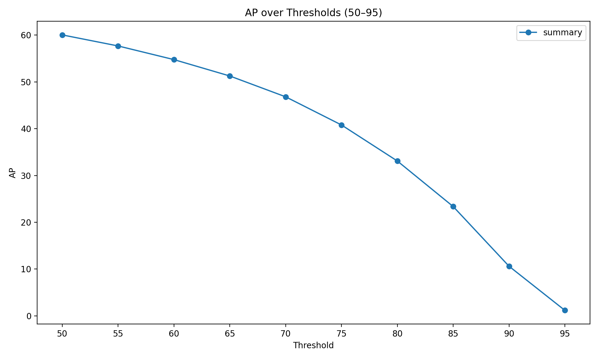

# TIDE Plus - Advanced Toolbox for Object Detection and Segmentation Error Analysis

```
████████╗██╗██████╗ ███████╗
╚══██╔══╝██║██╔══██╗██╔════╝
   ██║   ██║██║  ██║█████╗  
   ██║   ██║██║  ██║██╔══╝  
   ██║   ██║██████╔╝███████╗
   ╚═╝   ╚═╝╚═════╝ ╚══════╝
```

**TIDE Plus** extends [TIDE](https://github.com/dbolya/tide) with modernized utilities for comparing object detection and segmentation models.  
It provides:

- JSON export of all evaluation metrics  
- Detailed visual reports (mAP, precision/recall, error types, confusion matrices)  
- Multi-model and multi-dataset comparison  
- Averaging and visualization of confusion matrices  



---

## Installation

```bash
git clone https://github.com/kyzira/tide_plus.git
cd tide_plus
pip install .
```

---

## Quick Start

```python
from tidecv import TIDE, datasets

tide = TIDE()
tide.evaluate(
    datasets.COCO(),
    datasets.COCOResult("path/to/model_results.json"),
    mode=TIDE.BOX
)
tide.print_summary()
tide.save_summary("output/summary.json")
tide.plot(out_dir="output/plots")
```

Or take a look at the [example notebook](examples/coco_instance_segmentation.ipynb)

---

## Extended Usage Examples

### 1. Compare Multiple Models on the Same Ground Truth

```python
from tidecv import TIDE, datasets

gt = datasets.COCO("data/annotations.json")

model1 = datasets.COCOResult("results/model1.json")
model2 = datasets.COCOResult("results/model2.json")
model3 = datasets.COCOResult("results/model3.json")

tide = TIDE()
tide.evaluate_multiple_models_on_one_gt(
    gt,
    preds_list=[model1, model2, model3],
    names=["YOLOv8", "DETR", "Mask R-CNN"],
    mode=TIDE.MASK
)

tide.print_summary()
tide.plot(out_dir="results/Plots")
```

Generates:

- Bar plots comparing `mAP 50:95` for all models  
- Threshold-wise AP curves  
- Error breakdown charts (Class, Box, Missed, Background, etc.)  
- Model-specific confusion matrices  

---

### 2. Evaluate a Single Model Across Multiple Ground Truths

Useful when validating a model on different annotation sets or dataset splits.

```python
gt_list = [
    datasets.COCO("data/coco_val.json"),
    datasets.COCO("data/coco_extra.json"),
]
preds_list = [
    datasets.COCOResult("results/model_predictions_val.json"),
    datasets.COCOResult("results/model_predictions_extra.json"),
]

tide = TIDE()
tide.evaluate_model_on_multiple_gt(gt_list, preds_list, name="YOLOv8", mode=TIDE.BOX)
tide.print_summary()
tide.save_summary("results/summary_multi_gt.json")
```

Outputs an averaged summary across datasets and combined confusion matrix.

---

### 3. Export Results for Analysis

Each evaluation produces a structured summary JSON:

```python
summary = tide.get_summary()
tide.save_summary("results/tide_summary.json")
```

Example JSON structure:

```json
{
  "YOLOv8": {
    "mAP 50:95": 52.7,
    "Precision": {"Average": 78.5, "AP (Small)": 41.2},
    "Recall": {"Average": 70.1, "AR (Large)": 82.3},
    "Main Errors": {"Cls": 3.12, "Loc": 5.44, "Miss": 9.87},
    "Special Errors": {"FalsePos": 14.8, "FalseNeg": 12.9}
  }
}
```

---

### 4. Generate Visual Reports

```python
from tidecv import functions

summary = tide.get_summary()
functions.plot(summary, out_dir="results/Plots")
```

Creates:

- `mAP_comparison.png`
- `AP_thresholds_comparison.png`
- `Main_Errors_comparison.png`
- `Special_Errors_comparison.png`
- `Precision_comparison.png`
- Confusion matrix heatmaps for each model

---

### 5. Display Confusion Matrices in Console

```python
tide.print_confusion_matrices()
```

Example:

```
Confusion Matrix (YOLOv8):
[person, car, bus, dog, ...]
[[0.95, 0.01, 0.00, 0.00],
 [0.03, 0.88, 0.02, 0.00],
 [0.00, 0.04, 0.90, 0.00],
 [0.00, 0.00, 0.01, 0.97]]
```

---

### 6. Compute Average Metrics Across Runs

If you evaluated several models or datasets:

```python
tide.average_out_summary()
avg = tide.get_summary()["Combined Average"]
print(avg)
```

---

## Supported Datasets

- COCO  
- LVIS  
- Pascal VOC  
- Cityscapes  
- Custom datasets via the `Data` interface

---

## Citation

```
@inproceedings{tide-eccv2020,
  author    = {Daniel Bolya and Sean Foley and James Hays and Judy Hoffman},
  title     = {TIDE: A General Toolbox for Identifying Object Detection Errors},
  booktitle = {ECCV},
  year      = {2020},
}
```

---

## License

TIDE Plus is built upon [TIDE (ECCV 2020)](https://github.com/dbolya/tide) and distributed under the same license.
